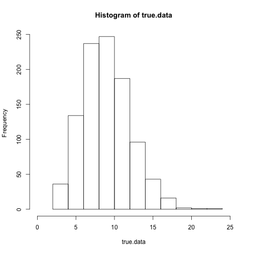
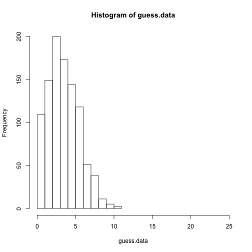
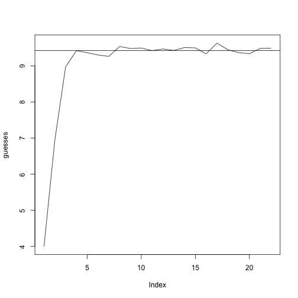
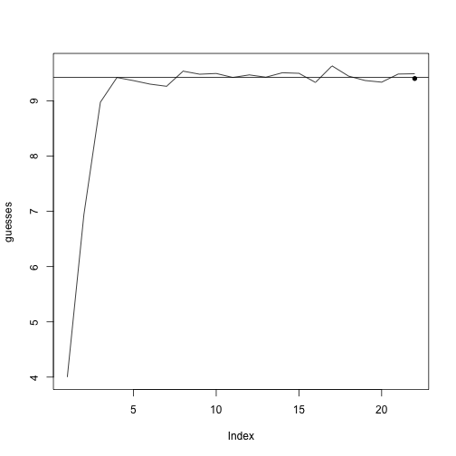

## Simple stochastic approximation example:
  
  
Let's generate 1000 Poisson-distributed values with a known `lambda` parameter.  The Poisson distribution's `lambda` parameter also happens to be the mean and variance of the distribution.


```r
set.seed(1)  # ensures that each time we run this, we get the same random values

n = 1000
lambda = 3 * pi  # about 9.425

true.data = rpois(n = n, lambda = lambda)
```


The data generated from the true model look like this:


```r
hist(true.data, xlim = c(0, 25))
```

 


Now let's say we don't know what lambda is, and we just guess that it's 4.


```r
lambda.guess = 4
guess.data = rpois(n = n, lambda = lambda.guess)
hist(guess.data, xlim = c(0, 25))
```

 


That doesn't look right at all. In fact, our guess gives us simulations that have 5.5 too few fish, on average.


```r
difference = (mean(true.data) - mean(guess.data))
difference
```


```
## [1] 5.505
```


So let's increase our guess by (some small multiple of) how much we underestimated to compensate.  (The bit about logs and exponentiation is just bookkeeping that has to do with the fact that the Poisson distribution can't have negative `lambda` values. If you're familiar with GLMs, we can say that the model uses a log link function).


```r
small.multiple = 0.1
lambda.guess = exp(log(lambda.guess) + small.multiple * difference)
lambda.guess
```


```
## [1] 6.936
```


The new guess is about 7, which is already much closer to the true value of 9.4

We can repeat this a few more times until the estimates converge:


```r
maxit = 20
guesses = numeric(length = maxit + 2)
guesses[1] = 4  #our initial guess was 4
guesses[2] = lambda.guess
for (i in 1:maxit) {
    guess.data = rpois(n = n, lambda = lambda.guess)
    difference = (mean(true.data) - mean(guess.data))
    lambda.guess = exp(log(lambda.guess) + small.multiple * difference)
    guesses[i + 2] = lambda.guess
}
```


Let's see how our estimates improved as we did more simulations:
  


```r
plot(guesses, type = "l")
abline(h = lambda)
```

 


We're definitely bouncing along near the true value, but we can do a bit better.

Let's run exactly the same code as before, but decrease the step size (`small.multiplier`) as we go so that we settle down closer to the maximum likelihood estimate.

The black dot is our final guess for lambda.


```r
for (i in 1:maxit) {
    small.multiple = small.multiple * 0.9
    guess.data = rpois(n = n, lambda = lambda.guess)
    difference = (mean(true.data) - mean(guess.data))
    lambda.guess = exp(log(lambda.guess) + small.multiple * difference)
}
plot(guesses, type = "l")
abline(h = lambda)
points(maxit + 2, lambda.guess, pch = 16)
```

 


Under the right circumstances, this approach is *guaranteed* to produce the maximum likelihood estimate, as long as we let it run long enough.
